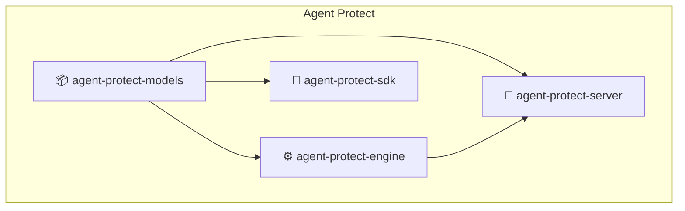

# 🛡️ Agent Protect

**A modular, type-safe protection system for AI Agents.**

Agent Protect allows you to define, validate, and enforce safety rules for your AI agents (LLM calls and tool executions). It isolates protection logic from your agent's business logic, providing a dedicated server and SDK to manage safety policies.

---

## 🏗 Architecture

Agent Protect is built as a monorepo with four distinct components:



| Package | Description |
| :--- | :--- |
| **`agent-protect-models`** | Shared **Pydantic v2** models for strict type safety across the stack. |
| **`agent-protect-engine`** | Core execution logic. Uses `google-re2` for safe regex and specialized evaluators. |
| **`agent-protect-server`** | FastAPI server that hosts the engine and provides a Rule Management API. |
| **`agent-protect-sdk`** | Python SDK for agents to register themselves and check protection status. |

---

## ✨ Key Features

- **Strict "Schema-on-Write" Rules**: Rules are defined using strict Pydantic models (`RegexConfig`, `ListConfig`). Invalid rules (e.g., bad regex patterns) are rejected by the API instantly.
- **Safe Execution**: Uses `google-re2` for linear-time regex matching, preventing ReDoS attacks.
- **Flexible Selectors**: Target any part of your data using dot-notation selectors (e.g., `arguments.query`, `context.user_id`).
- **Unified List Logic**: One evaluator handles both "AllowList" (only allow X) and "DenyList" (block Y) logic via simple configuration.
- **Type-Safe Payloads**: Differentiates between `LlmCall` (text in/out) and `ToolCall` (arguments/output), enabling precise rule targeting.

---

## 🚀 Quick Start

### 1. Prerequisites
- **uv**: Fast Python package manager (`curl -LsSf https://astral.sh/uv/install.sh | sh`)
- **Docker**: For running the database (PostgreSQL).

### 2. Setup

```bash
# clone repo
git clone https://github.com/yourusername/agent-protect.git
cd agent-protect

# Sync dependencies for all workspaces
make sync

# Start database
cd server && docker-compose up -d
make alembic-upgrade
```

### 3. Run the Server

```bash
# From repo root
make run-server
```
Server is now running at `http://localhost:8000`.

---

## 📖 Usage Guide

### 1. Defining Rules

Rules are defined via the API (or DB directly) using a JSON structure that matches our Pydantic models.

#### Example: Deny usage of "rm" command (DenyList)
```json
{
  "description": "Block dangerous commands",
  "enabled": true,
  "applies_to": "tool_call",
  "check_stage": "pre",
  "selector": { "path": "arguments.cmd" },
  "evaluator": {
    "type": "list",
    "config": {
      "values": ["rm", "shutdown", "reboot"],
      "logic": "any",
      "match_on": "match"
    }
  },
  "action": { "decision": "deny" }
}
```

#### Example: Allow ONLY specific regions (AllowList)
```json
{
  "description": "Enforce allowed regions",
  "applies_to": "tool_call",
  "check_stage": "pre",
  "selector": { "path": "arguments.region" },
  "evaluator": {
    "type": "list",
    "config": {
      "values": ["us-east-1", "eu-central-1"],
      "logic": "any",
      "match_on": "no_match"  
    }
  },
  "action": { "decision": "deny" }
}
```
*Note: `match_on: "no_match"` triggers the rule (Deny) if the value is **NOT** found in the list.*

#### Example: Detect PII via Regex
```json
{
  "description": "Block SSN in output",
  "applies_to": "llm_call",
  "check_stage": "post",
  "selector": { "path": "output" },
  "evaluator": {
    "type": "regex",
    "config": {
      "pattern": "\\b\\d{3}-\\d{2}-\\d{4}\\b",
      "flags": ["IGNORECASE"]
    }
  },
  "action": { "decision": "deny" }
}
```

#### Agent-scoped custom evaluators

To reference an agent's custom evaluator in a control, use `{agent_name}:{evaluator_name}` in the `plugin` field.

- Built-in plugins: `"plugin": "regex"`, `"plugin": "list"`
- Agent-scoped plugin: `"plugin": "my-agent:pii-detector"`

Example:
```json
{
  "description": "PII check via custom agent evaluator",
  "applies_to": "llm_call",
  "check_stage": "post",
  "selector": { "path": "output" },
  "evaluator": {
    "plugin": "my-agent:pii-detector",
    "config": { "sensitivity": "high", "types": ["ssn", "email"] }
  },
  "action": { "decision": "deny" }
}
```

### 2. Using the SDK

Install the SDK in your agent's environment (currently via local path or built wheel).

#### Initialization
```python
import agent_protect

# Initialize at startup
agent_protect.init(
    agent_name="CustomerSupportBot",
    agent_id="bot-prod-v1",
    server_url="http://localhost:8000"
)
```

#### Checking Safety
The SDK provides the `check_protection` method, which now accepts typed payloads:

```python
from agent_protect import AgentProtectClient
from agent_control_models import LlmCall, ToolCall

async with AgentProtectClient() as client:
    
    # 1. Check an LLM Input (Pre-execution)
    result = await client.check_protection(
        agent_uuid=agent.agent_id,
        payload=LlmCall(input="User's message here", output=None),
        check_stage="pre"
    )
    
    if not result.is_safe:
        print(f"Blocked: {result.matches[0].rule_name}")
        return

    # 2. Check a Tool Call (Pre-execution)
    tool_result = await client.check_protection(
        agent_uuid=agent.agent_id,
        payload=ToolCall(
            tool_name="aws_cli",
            arguments={"cmd": "rm -rf /"},
            context={"user_id": "123"}
        ),
        check_stage="pre"
    )
```

---

## 🛠 Development

### Commands (`Makefile`)

| Command | Description |
| :--- | :--- |
| `make sync` | Sync dependencies (`uv sync`) for all packages. |
| `make test` | Run tests across Server, Engine, and SDK. |
| `make lint` | Run `ruff` linting. |
| `make typecheck` | Run `mypy` static type checking. |
| `make check` | Run all quality checks (Test + Lint + Typecheck). |

### Directory Structure

- **`models/`**: Source of truth. All Pydantic models live here. Changes here propagate to Server and SDK.
- **`engine/`**: Pure logic. No API dependencies. Just input -> rules -> result.
- **`server/`**: API layer. Handles database, rule management, and calls the Engine.
- **`sdks/python/`**: Client library for agent developers.

---

## 🤝 Contributing

1. Fork the repo.
2. Create a feature branch.
3. Make changes (ensure `make check` passes).
4. Submit a Pull Request.
