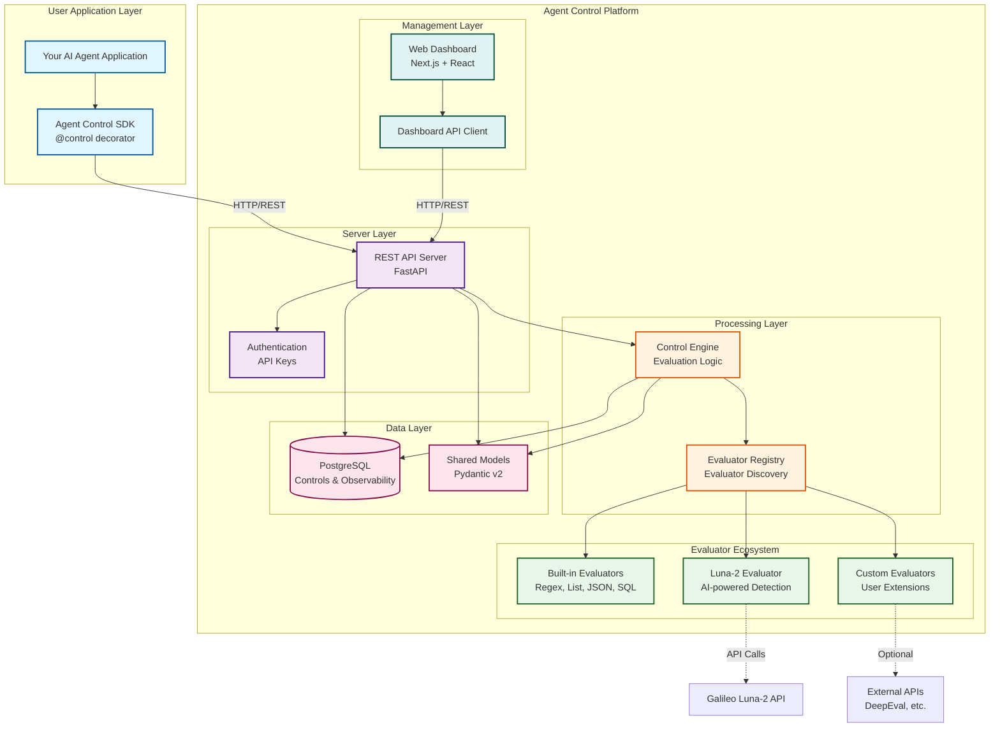

# Agent Control Reference

This document provides comprehensive technical reference for Agent Control. Each section is self-contained and can be read independently.

---

## Table of Contents

- [Introduction](#introduction)
- [Concepts](#concepts)
- [Architecture](#agent-control-architecture)
- [Evaluators](#evaluators)
- [SDK Reference](#sdk-reference)
- [Server API](#server-api)
- [Authentication](#authentication)
- [Configuration](#configuration)
- [Troubleshooting](#troubleshooting)

---

## Introduction

Agent Control provides a policy-based control layer that sits between your AI agents and the outside world. It evaluates inputs and outputs against configurable rules, blocking harmful content, prompt injections, PII leakage, and other risks.

### Why Agent Control?

AI agents are powerful but unpredictable. They can:

- Generate toxic or harmful content
- Be manipulated via prompt injection attacks
- Leak sensitive information (PII, secrets)
- Hallucinate incorrect facts
- Execute unintended actions

Agent Control gives you runtime control over what your agents can do, without modifying their code.

---

## Concepts

Understanding these core concepts will help you get the most out of Agent Control.

### Controls

A **Control** is a single rule that defines what to check and what to do when a condition is met.

```
Control = Scope + Selector + Evaluator + Action
```

Example: *"If the output contains an SSN pattern, block the response."*

```json
{
  "name": "block-ssn-in-output",
  "execution": "server",
  "scope": { "step_types": ["llm"], "stages": ["post"] },
  "selector": { "path": "output" },
  "evaluator": {
    "name": "regex",
    "config": { "pattern": "\\b\\d{3}-\\d{2}-\\d{4}\\b" }
  },
  "action": { "decision": "deny" }
}
```

### Policies

A **Policy** is a named collection of controls assigned to agents. Policies enable you to:

- Reuse control sets across multiple agents
- Version and audit your safety rules
- Apply different policies to different environments (dev/staging/prod)

```
Policy → Controls → Agents
```

### Check Stages

Controls run at different stages of execution:

| Stage | When | Use Case |
|-------|------|----------|
| `pre` | Before execution | Block bad inputs, prevent prompt injection |
| `post` | After execution | Filter bad outputs, redact PII |

### Selectors

A **Selector** defines what data to extract from the payload for evaluation.

| Path | Description | Example Use |
|------|-------------|-------------|
| `input` | Step input (tool args or LLM input) | Check for prompt injection |
| `output` | Step output | Check for PII leakage |
| `input.query` | Tool input field | Block SQL injection |
| `name` | Step name (tool name or model/chain id, required) | Restrict step usage |
| `context.user_id` | Context field | User-based rules |
| `*` | Entire step | Full payload analysis |

**Step Scoping**: Controls can scope by step type/name/stage:

```json
{
  "scope": {
    "step_types": ["tool"],
    "step_names": ["search_database", "execute_sql"],
    "step_name_regex": "^db_.*",
    "stages": ["pre"]
  }
}
```

### Actions

An **Action** defines what to do when a control matches:

| Action | Behavior |
|--------|----------|
| `deny` | Block the request/response, raise `ControlViolationError` |
| `steer` | Raise `ControlSteerError` with steering context for correction and retry |
| `allow` | Permit execution (no effect if a `deny` control also matches) |
| `warn` | Log a warning but allow execution |
| `log` | Silent logging for monitoring only |

> **Note**: Agent Control uses priority-based semantics:
> 1. **deny wins** - If any `deny` control matches, execution is blocked
> 2. **steer second** - If any `steer` control matches (and no deny), a `ControlSteerError` is raised with correction steering context
> 3. **allow/warn/log** - Observability actions that don't block execution

### Step Types

Controls can scope to different step types:

| Type | Description |
|------|-------------|
| `llm` | LLM interactions (input/output text) |
| `tool` | Tool executions (input/output) |

---

## Agent Control Architecture



## Component Overview

### User Application Layer
- **Your AI Agent Application**: Any Python application using AI agents (LangChain, CrewAI, custom, etc.)
- **Agent Control SDK**: Python package with `@control()` decorator for protecting functions

### Server Layer
- **REST API Server**: FastAPI-based server exposing control management endpoints
- **Authentication**: Optional API key authentication for production deployments

### Processing Layer
- **Control Engine**: Core evaluation engine that processes control rules and evaluates data
- **Evaluator Registry**: Evaluator system for discovering and loading evaluators via entry points

### Evaluator Ecosystem
- **Built-in Evaluators**: Out-of-the-box evaluators (regex, list matching, JSON validation, SQL injection detection)
- **Luna-2 Evaluator**: AI-powered detection using Galileo's Luna-2 API
- **Custom Evaluators**: User-defined evaluators extending the base `Evaluator` class

### Data Layer
- **PostgreSQL**: Persistent storage for controls, agents, and observability data
- **Shared Models**: Pydantic v2 models shared across all components

### Management Layer
- **Web Dashboard**: Next.js + React UI for managing agents and controls
- **Dashboard API Client**: Type-safe API client for frontend-backend communication

## Data Flow

### Agent Initialization
1. **Agent Registration**: Agent initializes with `agent_control.init()`, registering with the server
2. **Policy Assignment**: Server returns the agent's assigned policy and active controls

### Control Execution Flow
1. **Function Invocation**: User calls a function decorated with `@control()`
2. **Pre-Stage Evaluation**: SDK evaluates `pre` controls before function execution
3. **Function Execution**: If all `pre` controls pass, the protected function executes
4. **Post-Stage Evaluation**: SDK evaluates `post` controls on the output
5. **Server Processing**: Server receives evaluation request and fetches active controls
6. **Engine Evaluation**: Engine runs applicable evaluators based on control configuration
7. **Decision Enforcement**: If any control with `deny` action matches, `ControlViolationError` is raised; otherwise execution continues

### Control Management Flow
1. **User Configures**: Admin uses Web Dashboard or API to create/modify controls
2. **Server Stores**: Server validates and stores control configuration in database
3. **Runtime Updates**: Changes take effect immediately for new requests (no deployment needed)
4. **Observability**: All control executions are logged for monitoring and analysis

## Key Features

- **Runtime Configuration**: Update controls without redeploying applications
- **Extensible**: Evaluator architecture for custom evaluators
- **Fail-Safe**: Configurable error handling (fail open/closed)
- **Observable**: Full audit trail of control executions
- **Production-Ready**: API authentication, PostgreSQL, horizontal scaling support

---

## Evaluators

Agent Control includes powerful evaluators out of the box.

### Regex Evaluator

Pattern matching using Google RE2 (safe from ReDoS attacks).

**Evaluator name**: `regex`

**Configuration**:

| Option | Type | Required | Description |
|--------|------|----------|-------------|
| `pattern` | string | Yes | Regular expression pattern (RE2 syntax) |
| `flags` | list | No | Optional: `["IGNORECASE"]` |

**Examples**:

```json
// Block Social Security Numbers
{
  "name": "regex",
  "config": {
    "pattern": "\\b\\d{3}-\\d{2}-\\d{4}\\b"
  }
}

// Block credit card numbers (case-insensitive)
{
  "name": "regex",
  "config": {
    "pattern": "card.*\\d{4}[- ]?\\d{4}[- ]?\\d{4}[- ]?\\d{4}",
    "flags": ["IGNORECASE"]
  }
}

// Block AWS access keys
{
  "name": "regex",
  "config": {
    "pattern": "AKIA[0-9A-Z]{16}"
  }
}
```

**Use cases**: PII detection, secret scanning, pattern-based blocklists.

---

### List Evaluator

Flexible value matching with multiple modes and logic options.

**Evaluator name**: `list`

**Configuration**:

| Option | Type | Default | Description |
|--------|------|---------|-------------|
| `values` | list | required | Values to match against |
| `logic` | string | `"any"` | `"any"` = match any value, `"all"` = match all |
| `match_on` | string | `"match"` | `"match"` = trigger when found, `"no_match"` = trigger when NOT found |
| `match_mode` | string | `"exact"` | `"exact"` = full string match, `"contains"` = word-boundary match |
| `case_sensitive` | bool | `false` | Case sensitivity |

> **Note**: `match_mode="contains"` uses word-boundary matching, not generic substring matching. For example, `"admin"` will match `"admin user"` or `"the admin"` but will NOT match `"sysadministrator"`.

**Examples**:

```json
// Block admin/root keywords
{
  "name": "list",
  "config": {
    "values": ["admin", "root", "sudo", "superuser"],
    "logic": "any",
    "match_mode": "contains",
    "case_sensitive": false
  }
}

// Require approval keyword (trigger if NOT found)
{
  "name": "list",
  "config": {
    "values": ["APPROVED", "VERIFIED"],
    "match_on": "no_match",
    "logic": "any"
  }
}

// Allowlist: only permit specific tools
{
  "name": "list",
  "config": {
    "values": ["search", "calculate", "lookup"],
    "match_on": "no_match"
  }
}
```

**Use cases**: Keyword blocklists/allowlists, required terms, tool restrictions.

---

### Luna-2 Evaluator

AI-powered detection using Galileo's Luna-2 small language models. Provides real-time, low-latency evaluation for complex patterns that can't be caught with regex or lists.

**Evaluator name**: `galileo.luna2`

**Installation**: Luna-2 is available as a separate package:

```bash
# Direct install
pip install agent-control-evaluator-galileo

# Or via convenience extra
pip install agent-control-evaluators[galileo]
```

**Requirements**: Set `GALILEO_API_KEY` environment variable where evaluations run (on the server for server-side controls, or in the client environment for local controls).

**Configuration**:

| Option | Type | Default | Description |
|--------|------|---------|-------------|
| `stage_type` | string | `"local"` | `"local"` (runtime rules) or `"central"` (pre-defined stages) |
| `metric` | string | — | Metric to evaluate. **Required if `stage_type="local"`.** |
| `operator` | string | — | `"gt"`, `"lt"`, `"gte"`, `"lte"`, `"eq"`, `"contains"`, `"any"`. **Required if `stage_type="local"`.** |
| `target_value` | string/number | — | Threshold value. **Required if `stage_type="local"`.** |
| `stage_name` | string | — | Stage name in Galileo. **Required if `stage_type="central"`.** |
| `stage_version` | int | — | Pin to specific stage version |
| `galileo_project` | string | — | Project name for logging |
| `timeout_ms` | int | `10000` | Request timeout (1000-60000 ms) |
| `on_error` | string | `"allow"` | `"allow"` (fail open) or `"deny"` (fail closed) |
| `payload_field` | string | — | Explicitly set payload field (`"input"` or `"output"`) |
| `metadata` | object | — | Additional metadata to send with request |

**Available Metrics**:

| Metric | Description |
|--------|-------------|
| `input_toxicity` | Toxic/harmful content in user input |
| `output_toxicity` | Toxic/harmful content in agent response |
| `input_sexism` | Sexist content in user input |
| `output_sexism` | Sexist content in agent response |
| `prompt_injection` | Prompt manipulation attempts |
| `pii_detection` | Personally identifiable information |
| `hallucination` | Potentially false or fabricated statements |
| `tone` | Communication tone analysis |

**Examples**:

```json
// Block toxic inputs (score > 0.5)
{
  "name": "galileo.luna2",
  "config": {
    "metric": "input_toxicity",
    "operator": "gt",
    "target_value": 0.5,
    "galileo_project": "my-project"
  }
}

// Block prompt injection attempts
{
  "name": "galileo.luna2",
  "config": {
    "metric": "prompt_injection",
    "operator": "gt",
    "target_value": 0.7,
    "on_error": "deny"
  }
}

// Flag potential hallucinations (warn but allow)
{
  "name": "galileo.luna2",
  "config": {
    "metric": "hallucination",
    "operator": "gt",
    "target_value": 0.6
  }
}

// Using central stage (pre-defined in Galileo)
{
  "name": "galileo.luna2",
  "config": {
    "stage_type": "central",
    "stage_name": "production-safety",
    "galileo_project": "my-project"
  }
}
```

**Use cases**: Toxicity detection, prompt injection protection, hallucination flagging.

---

### Custom Evaluators

You can create custom evaluators to extend Agent Control with your own detection capabilities.

**Evaluator Interface**:

```python
from typing import Any

from agent_control_models import EvaluatorResult
from agent_control_evaluators import (
    Evaluator,
    EvaluatorConfig,
    EvaluatorMetadata,
    register_evaluator,
)


class MyEvaluatorConfig(EvaluatorConfig):
    """Configuration schema for your evaluator."""
    threshold: float = 0.5
    custom_option: str = "default"


@register_evaluator
class MyEvaluator(Evaluator[MyEvaluatorConfig]):
    """Your custom evaluator."""

    metadata = EvaluatorMetadata(
        name="my-evaluator",
        version="1.0.0",
        description="Detects custom patterns using proprietary logic",
        requires_api_key=True,
        timeout_ms=5000,
    )
    config_model = MyEvaluatorConfig

    def __init__(self, config: MyEvaluatorConfig) -> None:
        super().__init__(config)
        # Set up clients, load models, etc.

    async def evaluate(self, data: Any) -> EvaluatorResult:
        """
        Evaluate the input data.

        Returns:
            EvaluatorResult with:
              - matched: bool — Did this trigger the control?
              - confidence: float — How confident (0.0-1.0)?
              - message: str — Human-readable explanation
              - metadata: dict — Additional context for logging
        """
        score = await self._analyze(data)

        return EvaluatorResult(
            matched=score > self.config.threshold,
            confidence=score,
            message=f"Custom analysis score: {score:.2f}",
            metadata={"score": score, "threshold": self.config.threshold}
        )
```

**Registration**: Evaluators are discovered via Python entry points. Add to your `pyproject.toml`:

```toml
[project.entry-points."agent_control.evaluators"]
my-evaluator = "my_package.evaluator:MyEvaluator"
```

**Optional Dependencies**: Override `is_available()` if your evaluator has optional dependencies:

```python
@register_evaluator
class MyEvaluator(Evaluator[MyEvaluatorConfig]):
    @classmethod
    def is_available(cls) -> bool:
        try:
            import optional_lib
            return True
        except ImportError:
            return False
```

When `is_available()` returns `False`, the evaluator is silently skipped during registration.

**Best Practices**:

| Practice | Why |
|----------|-----|
| Use Pydantic for config | Automatic validation and documentation |
| Implement timeouts | Prevent slow evaluators from blocking agents |
| Return confidence scores | Enable threshold-based filtering |
| Include metadata | Helps with debugging and observability |
| Handle errors gracefully | Respect the `on_error` configuration |
| Make API calls async | Don't block the event loop |

---

## SDK Reference

The Python SDK provides decorator-based protection and programmatic control management.

### Initialization

```python
import agent_control

agent_control.init(
    agent_name="my-agent",           # Required: human-readable name
    agent_name="550e8400-e29b-41d4-a716-446655440000",  # Required: UUID
    server_url="http://localhost:8000",  # Optional: defaults to env var
    steps=[                          # Optional: register available steps
        {
            "type": "tool",
            "name": "search",
            "input_schema": {"query": {"type": "string"}},
            "output_schema": {"results": {"type": "array"}}
        }
    ]
)
```

### The @control Decorator

The `@control()` decorator applies server-side policies to any function.

```python
from agent_control import control

@control()
async def chat(message: str) -> str:
    return await llm.generate(message)
```

**Behavior**:

1. Extracts input from function parameters (tries `input`, `message`, `query`, etc.)
2. Calls server to evaluate `pre` controls
3. If `pre` controls pass, executes the function
4. Calls server to evaluate `post` controls with the output
5. If any `deny` control matches, raises `ControlViolationError`

**Works with both sync and async functions**.

**Parameters**:

- `policy` (str, optional): Policy name for documentation purposes. The agent's assigned policy is automatically used.
- `step_name` (str, optional): Custom name for this step. If not provided, uses the function name. Useful for:
  - Overriding auto-detected names when they don't match your control configuration
  - Applying the same controls to functions with different names

**Custom Step Name Example**:

```python
# Use custom step name for control matching
@control(step_name="user_input_handler")
async def handle_customer_query(text: str) -> str:
    return await process(text)

@control(step_name="user_input_handler")
async def handle_support_request(request: str) -> str:
    return await process(request)

# Both functions are evaluated using the same "user_input_handler" step name,
# allowing you to apply the same controls to both without duplicating configuration
```

### Error Handling

```python
from agent_control import control, ControlViolationError

@control()
async def chat(message: str) -> str:
    return await llm.generate(message)

try:
    response = await chat(user_input)
except ControlViolationError as e:
    print(f"Control: {e.control_name}")
    print(f"Message: {e.message}")
    print(f"Metadata: {e.metadata}")
```

**ControlViolationError attributes**:

| Attribute | Type | Description |
|-----------|------|-------------|
| `control_name` | str | Which control triggered |
| `message` | str | Why it was blocked |
| `metadata` | dict | Additional context |

#### ControlSteerError

Raised when a control with `action="steer"` matches. Provides steering context for correction and allows retry:

```python
from agent_control import control, ControlSteerError

@control()
async def process_transfer(amount: float, verified_2fa: bool = False) -> dict:
    return {"status": "completed"}

try:
    result = await process_transfer(amount=15000, verified_2fa=False)
except ControlSteerError as e:
    print(f"Steering context: {e.steering_context}")
    # Follow steering context: request 2FA from user
    code = get_2fa_code_from_user()
    # Retry with corrected parameters
    result = await process_transfer(amount=15000, verified_2fa=True)
```

**ControlSteerError attributes**:

| Attribute | Type | Description |
|-----------|------|-------------|
| `control_name` | str | Which control triggered |
| `message` | str | Why steering is required |
| `steering_context` | str | Corrective action instructions |
| `metadata` | dict | Additional context |

### Direct Client Usage

For programmatic control management:

```python
from agent_control import AgentControlClient, controls

async with AgentControlClient() as client:
    # Health check
    health = await client.health_check()

    # Create a control for LLM output
    ctrl = await controls.create_control(
        client,
        name="block-pii",
        data={
            "execution": "server",
            "scope": {"step_types": ["llm"], "stages": ["post"]},
            "selector": {"path": "output"},
            "evaluator": {
                "name": "regex",
                "config": {"pattern": r"\d{3}-\d{2}-\d{4}"}
            },
            "action": {"decision": "deny"}
        }
    )

    # Create a control for tool steps
    tool_ctrl = await controls.create_control(
        client,
        name="block-dangerous-paths",
        data={
            "execution": "server",
            "scope": {
                "step_types": ["tool"],
                "step_names": ["read_file", "write_file", "delete_file"],
                "stages": ["pre"]
            },
            "selector": {
                "path": "input.path"
            },
            "evaluator": {
                "name": "regex",
                "config": {"pattern": r"^/(etc|var|usr|root)/"}
            },
            "action": {"decision": "deny"}
        }
    )

    # List controls
    all_controls = await controls.list_controls(client)

    # Update control
    await controls.update_control(client, ctrl["control_id"], enabled=False)
```

### Available Functions

**Top-level functions:**

| Function | Description |
|----------|-------------|
| `agent_control.init()` | Initialize and register agent |
| `agent_control.current_agent()` | Get the initialized agent |
| `agent_control.list_agents()` | List all registered agents |
| `agent_control.get_agent(id)` | Get agent by ID |
| `agent_control.create_control()` | Create a new control |
| `agent_control.list_controls()` | List controls with filtering |
| `agent_control.get_control()` | Get control by ID |
| `agent_control.update_control()` | Update control properties |
| `agent_control.delete_control()` | Delete a control |
| `agent_control.add_control_to_policy()` | Add control to policy |
| `agent_control.remove_control_from_policy()` | Remove control from policy |
| `agent_control.list_policy_controls()` | List controls in a policy |

**Policy management** (via `agent_control.policies` module):

| Function | Description |
|----------|-------------|
| `policies.create_policy()` | Create a new policy |
| `policies.assign_policy_to_agent()` | Assign policy to agent |

---

## Server API

The Agent Control server exposes a RESTful API for managing agents, controls, and policies.

### Base URL

Default: `http://localhost:8000/api/v1`

### Endpoints

**Agents**:

| Method | Endpoint | Description |
|--------|----------|-------------|
| `GET` | `/agents` | List all agents |
| `POST` | `/agents/initAgent` | Register a new agent |
| `GET` | `/agents/{agent_name}` | Get agent details |
| `PATCH` | `/agents/{agent_name}` | Update agent |
| `GET` | `/agents/{agent_name}/controls` | List controls for agent |
| `GET` | `/agents/{agent_name}/policy` | Get agent's policy |
| `POST` | `/agents/{agent_name}/policy/{policy_id}` | Assign policy |
| `DELETE` | `/agents/{agent_name}/policy` | Remove policy |

**Controls**:

| Method | Endpoint | Description |
|--------|----------|-------------|
| `PUT` | `/controls` | Create control |
| `GET` | `/controls` | List controls |
| `GET` | `/controls/{control_id}` | Get control |
| `PATCH` | `/controls/{control_id}` | Update control |
| `DELETE` | `/controls/{control_id}` | Delete control |

**Policies**:

| Method | Endpoint | Description |
|--------|----------|-------------|
| `PUT` | `/policies` | Create policy |
| `GET` | `/policies/{policy_id}/controls` | List controls in policy |
| `POST` | `/policies/{policy_id}/controls/{control_id}` | Add control to policy |
| `DELETE` | `/policies/{policy_id}/controls/{control_id}` | Remove control |

**System**:

| Method | Endpoint | Description |
|--------|----------|-------------|
| `GET` | `/health` | Health check (no auth required) |

---

## Authentication

Agent Control supports API key authentication for production deployments.

### Configuration

Authentication is controlled by environment variables:

| Variable | Default | Description |
|----------|---------|-------------|
| `AGENT_CONTROL_API_KEY_ENABLED` | `false` | Master toggle for authentication |
| `AGENT_CONTROL_API_KEYS` | — | Comma-separated list of valid API keys |
| `AGENT_CONTROL_ADMIN_API_KEYS` | — | Comma-separated list of admin API keys |

### Usage

Include the API key in the `X-API-Key` header:

```bash
curl -H "X-API-Key: your-api-key" http://localhost:8000/api/v1/agents
```

With the Python SDK:

```python
from agent_control import AgentControlClient

# Via constructor
async with AgentControlClient(api_key="your-api-key") as client:
    await client.health_check()

# Or via environment variable
# export AGENT_CONTROL_API_KEY="your-api-key"
async with AgentControlClient() as client:
    await client.health_check()
```

### Access Levels

| Endpoint | Required Level |
|----------|----------------|
| `/health` | Public (no auth) |
| All `/api/v1/*` | API key required |

### Key Rotation

Agent Control supports multiple API keys for zero-downtime rotation:

1. Add new key to `AGENT_CONTROL_API_KEYS` (e.g., `key1,key2,new-key`)
2. Deploy the server
3. Update clients to use the new key
4. Remove the old key from the variable
5. Redeploy

---

## Configuration

### Server Environment Variables

| Variable | Default | Description |
|----------|---------|-------------|
| `HOST` | `0.0.0.0` | Server bind address |
| `PORT` | `8000` | Server port |
| `DEBUG` | `false` | Enable debug mode |
| `API_VERSION` | `v1` | API version prefix |
| `API_PREFIX` | `/api` | API path prefix |

**CORS**:

| Variable | Default | Description |
|----------|---------|-------------|
| `CORS_ORIGINS` | `*` | Allowed origins (comma-separated) |
| `ALLOW_METHODS` | `*` | Allowed HTTP methods |
| `ALLOW_HEADERS` | `*` | Allowed headers |

**Database**:

| Variable | Default | Description |
|----------|---------|-------------|
| `DB_HOST` | `localhost` | PostgreSQL host |
| `DB_PORT` | `5432` | PostgreSQL port |
| `DB_USER` | `agent_control` | Database user |
| `DB_PASSWORD` | `agent_control` | Database password |
| `DB_DATABASE` | `agent_control` | Database name |
| `DB_DRIVER` | `psycopg` | Database driver |
| `DATABASE_URL` or `DB_URL` | — | Full database URL (overrides above). `DATABASE_URL` is preferred for Docker environments. |

**Authentication**:

| Variable | Default | Description |
|----------|---------|-------------|
| `AGENT_CONTROL_API_KEY_ENABLED` | `false` | Enable API key auth |
| `AGENT_CONTROL_API_KEYS` | — | Valid API keys (comma-separated) |
| `AGENT_CONTROL_ADMIN_API_KEYS` | — | Admin API keys (comma-separated) |

**Evaluators**:

| Variable | Default | Description |
|----------|---------|-------------|
| `GALILEO_API_KEY` | — | API key for Luna-2 evaluator |

### SDK Environment Variables

| Variable | Default | Description |
|----------|---------|-------------|
| `AGENT_CONTROL_URL` | `http://localhost:8000` | Server URL |
| `AGENT_CONTROL_API_KEY` | — | API key for authentication |

### UI Environment Variables

| Variable | Default | Description |
|----------|---------|-------------|
| `NEXT_PUBLIC_API_URL` | `http://localhost:8000` | Backend API URL |

### Database Setup

Agent Control uses PostgreSQL. The easiest way to run it locally:

```bash
cd server
docker-compose up -d          # Start PostgreSQL
make alembic-upgrade          # Run migrations
```

Default credentials in docker-compose:
- User: `agent_control`
- Password: `agent_control`
- Database: `agent_control`
- Port: `5432`

---

## Troubleshooting

### Server Connection Issues

```bash
# Check if server is running
curl http://localhost:8000/health
# Expected: {"status":"healthy","version":"0.1.0"}
```

### Import Errors

```bash
# Install the SDK from workspace root
make sync

# Or install directly
pip install -e sdks/python
```

### Authentication Errors

If you get 401 Unauthorized:

1. Check if auth is enabled: `AGENT_CONTROL_API_KEY_ENABLED`
2. Verify your API key is in `AGENT_CONTROL_API_KEYS`
3. Ensure the `X-API-Key` header is set correctly

### Database Connection Issues

```bash
# Check if PostgreSQL is running
docker ps | grep postgres

# Restart the database
cd server && docker-compose down && docker-compose up -d

# Re-run migrations
make alembic-upgrade
```

### Control Not Triggering

1. Verify the control is enabled
2. Check `scope.step_types` matches your step type (`llm` vs `tool`)
3. Check `scope.stages` is correct (`pre` for input, `post` for output)
4. Verify the selector path matches your data structure
5. Test the evaluator pattern/values independently

### Luna-2 Evaluator Errors

1. Ensure the Galileo package is installed: `pip install agent-control-evaluator-galileo` (or `pip install agent-control-evaluators[galileo]`)
2. Ensure `GALILEO_API_KEY` is set
3. Check network connectivity to Galileo API
4. Verify the metric name is valid
5. Check `on_error` setting if failures are silently allowed

**Evaluator Not Found**: If `galileo.luna2` doesn't appear in `list_evaluators()`:
- Verify the Galileo package is installed
- Check server logs for evaluator discovery messages
